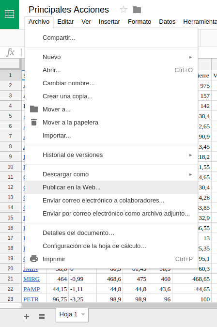
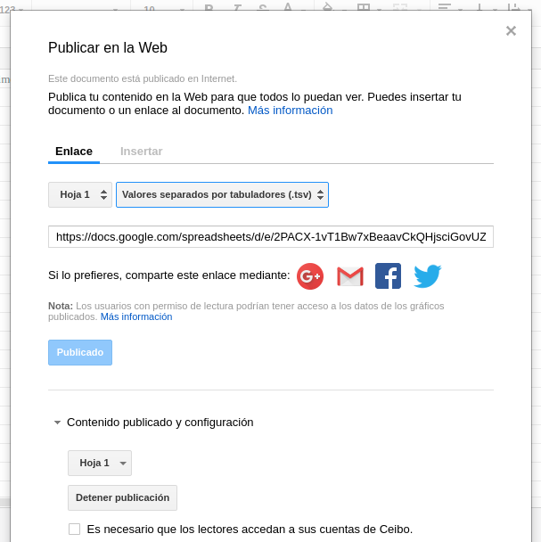

Simple TSV to JSON parse. Uses the first line as headers and returns an observable


### Instalation
  npm install --save tsv-parser
  yarn add tsv-parser

### Use (uses rxjs)
```js
import { parse } from tsv-parser
parse('http://fileLocation.tsv')
.subscribe(console.log)
```

### With Google Sheets as data source
You can easily create a data source from a google sheet. You hace to publish it and select tsv format. That action will return a url. Then you only..
```js
import { parse } from tsv-parser
parse(googleUrl.tsv)
.subscribe(console.log)
```

It's in spanish but you'll get the idea...

